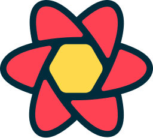

<!---->

<!--<h1 align='center'>I am Branimir Djordjevic</h1>-->
<h1 align='center'>Frontend web developer</h3>

## `How to reach me`

#### Social Network Links

#### E-mail

**branimir1111@gmail.com**

## `Languages and Tools `

<!--HTML, CSS, JavaScript, TypeScript, React, Next, Node, Express, MongoDB -->

#### Languages

<!-- Additional tools -->

#### Additional tools

<!-- Python, PyTorch, ThreeJs, Blender -->

#### I’m currently learning

