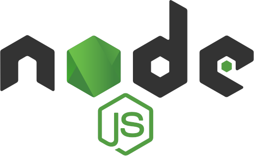
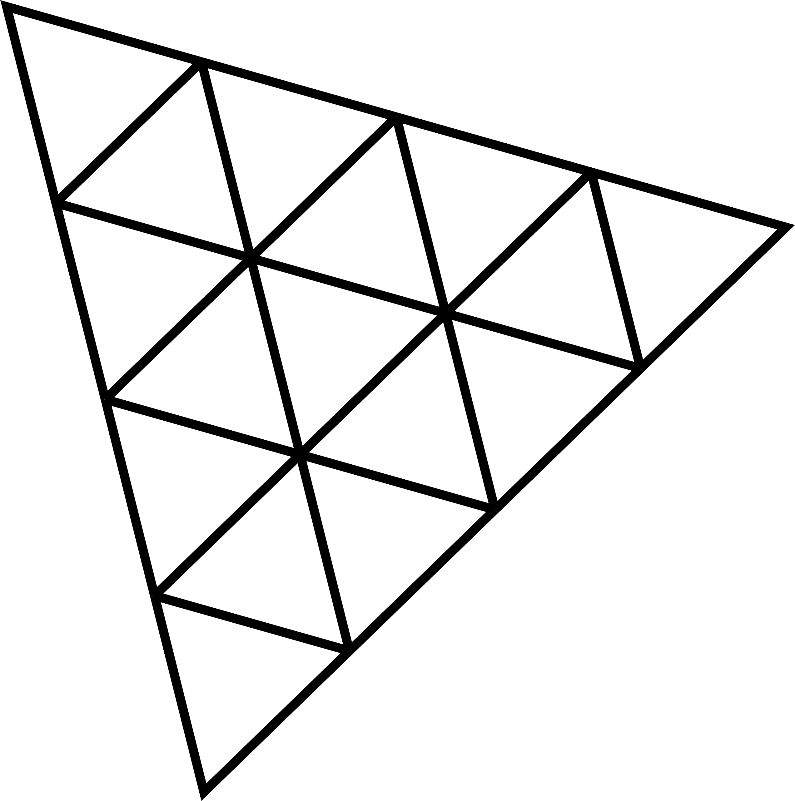

# 
 Hi, I'm Branimir Djordjevic

## 
I am Frontend web developer

<h3 style='color:#c026d3'><ins>How to reach me</ins> </h3>

> **🌐 Social Network Links**

  

> **📧 E-mail**

**branimir1111@gmail.com**
 

<h3 style='color:#c026d3'><ins> Languages and Tools</ins> </h3>

<!-- HTML, CSS, TailwindCSS, SASS -->

> **Styling**

   

<!-- JavaScript, TypeScript -->

> **Languages**

  

<!--React, Next -->

> **Libraries and frameworks**

<a href="https://nextjs.org/" target="_blank" rel="noreferrer"><svg xmlns="http://www.w3.org/2000/svg" viewBox="0 0 180 180" width="40"><mask height="180" id=":r8:mask0_408_134" maskUnits="userSpaceOnUse" width="180" x="0" y="0" style="mask-type: alpha;"><circle cx="90" cy="90" fill="black" r="90"></circle></mask><g mask="url(#:r8:mask0_408_134)"><circle cx="90" cy="90" data-circle="true" fill="black" r="90"></circle><path d="M149.508 157.52L69.142 54H54V125.97H66.1136V69.3836L139.999 164.845C143.333 162.614 146.509 160.165 149.508 157.52Z" fill="url(#:r8:paint0_linear_408_134)"></path><rect fill="url(#:r8:paint1_linear_408_134)" height="72" width="12" x="115" y="54"></rect></g><defs><linearGradient gradientUnits="userSpaceOnUse" id=":r8:paint0_linear_408_134" x1="109" x2="144.5" y1="116.5" y2="160.5"><stop stop-color="white"></stop><stop offset="1" stop-color="white" stop-opacity="0"></stop></linearGradient><linearGradient gradientUnits="userSpaceOnUse" id=":r8:paint1_linear_408_134" x1="121" x2="120.799" y1="54" y2="106.875"><stop stop-color="white"></stop><stop offset="1" stop-color="white" stop-opacity="0"></stop></linearGradient></defs></svg></a>

<!-- Node, Express, MongoDB -->

> **Backend**

 

<!-- Git -->

> **Version control system**

<!-- Python, PyTorch -->

> **I’m currently learning**

 

<!-- ThreeJs, Blender -->

> **3D World**

<!-- Most used languages -->

> **Statistics**

